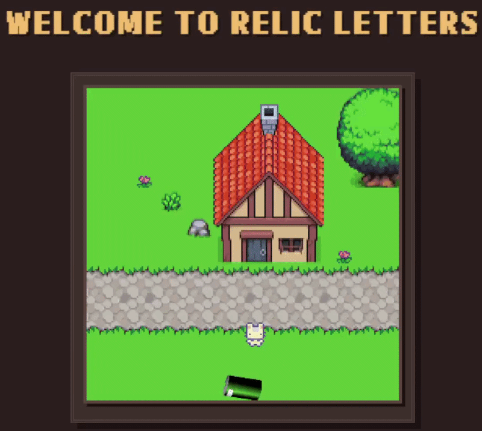
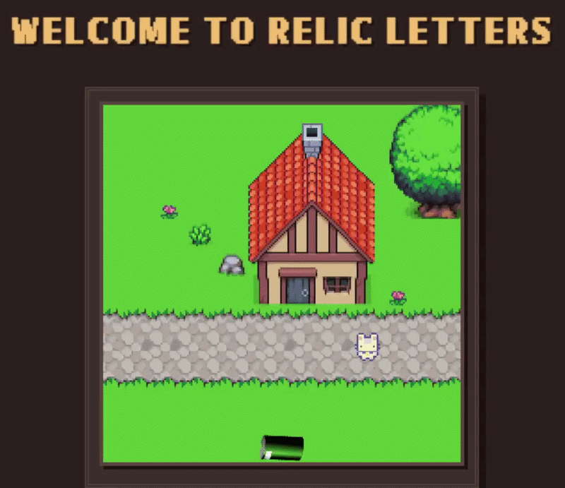
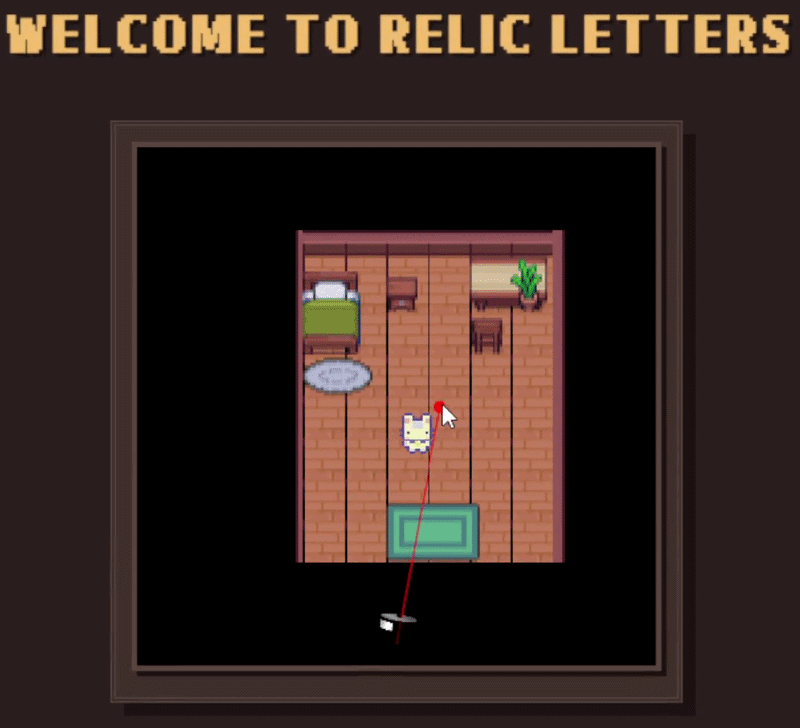
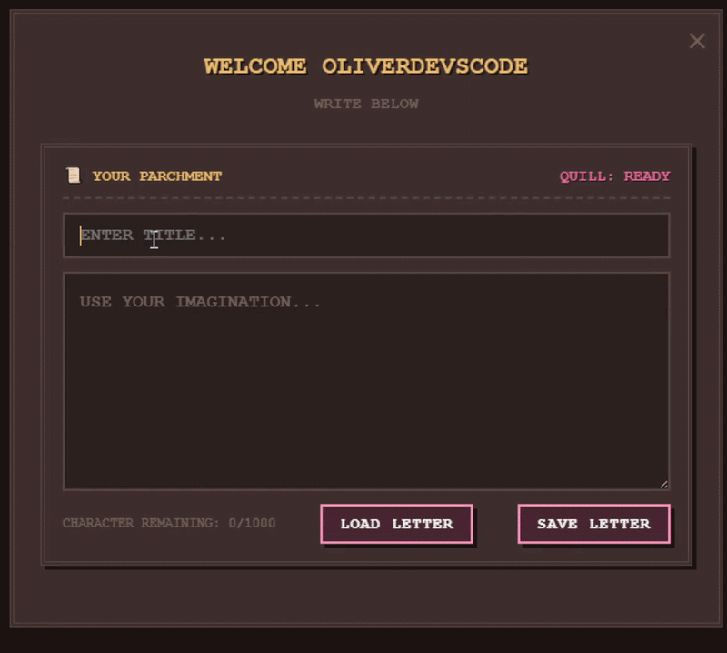
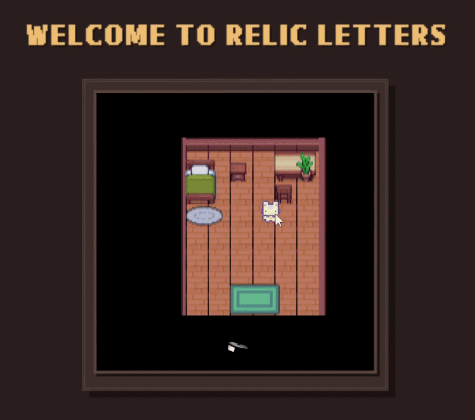
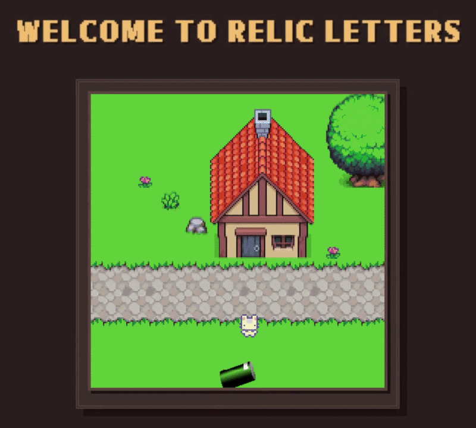
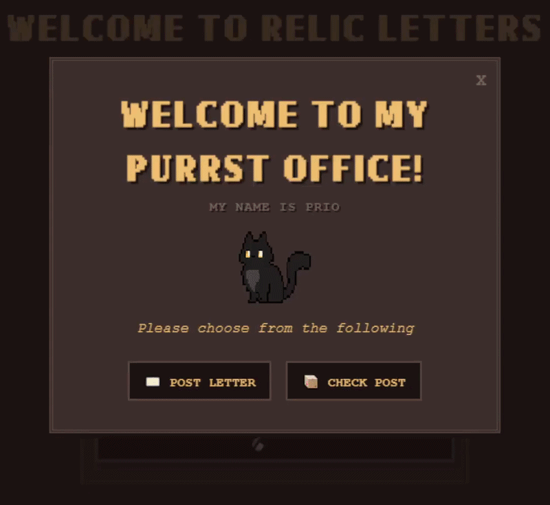
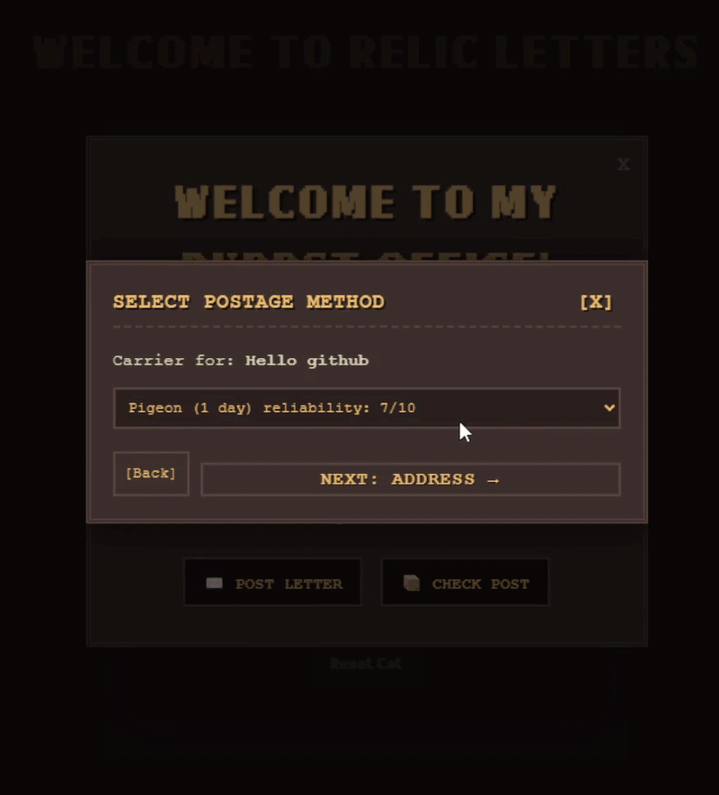

# Relic Letters
A custom medieval fantasy themed letter app I wrote for a special someone


> **Note:** This project was originally built as a heartfelt gift for a special someone. You are completely welcome to **fork, tweak, and re-skin** this codebase to create a magical experience for your own special someone! All I ask is that you maintain a visible link crediting this original repository.

## Key Features
* Move into your house - create your own address
* Write letters at your desk
* Keep a collection of previous letters
* Visit the post office to post a letter
* Choose all kind of postage options!
* Collect your post
* Recieve notificaions when someone has posted to you

## Upcoming Features + Roadmap
* Some mail gets lost - you may have to search the map to find it
* Hidden messages - some letters may have a cipher
*Notifications when letters arrive
*View all missed notificaions in app and manage them

## Gameplay Demonstrations

### Settling In & Movement

| Getting Around | Moving into your House   |
| :---: | :---: |
|  |   | 

---

### Your Home

| Inside the Home | Writing a Letter | Viewing Your Mail |
| :---: | :---: | :---: |
|  |  |  |

---

### The local Post Office

| The Post Office | Posting Experience | Address System |
| :---: | :---: | :---: |
|  |  |
|  | |

## Tech Stack & Architecture

* **Frontend:** React (bundled with Vite)
* **Styling:** Custom CSS Layouts
* **Database & Auth:** Firebase (Firestore / Firebase Auth / Firebase Cloud Messaging)
* **Backend Server:** Node.js (Dedicated server for handling post operations and queues)

## Running your own version!

### Prerequisites
Before running this project, ensure you have the following installed on your machine:
* **Node.js** (v18.x or higher recommended)
* **npm** (comes bundled with Node)

### Environment Variables
This project requires several Firebase and backend configuration keys to function properly. Create a `.env` file in the root directory of the frontend project. A template file named `.env.example` is provided in the root directory:

### Installation & Running Locally

Follow these steps to get your local development environment up and running:

1. **Clone the repository:**
   ```bash
   git clone [https://github.com/yourusername/relic-letters.git](https://github.com/yourusername/relic-letters.git)

2. **Navigate into the project directory:**
   ```bash
   cd relic-letters

3. **Install dependencies:**
   ```bash
   npm install
   

4. **Start the Vite development server:**
   ```bash
   npm run dev
   

Open your browser and navigate to the local address provided in your terminal (usually `http://localhost:5173`).

*(Note: Link to the Node.js backend repository and server-side setup instructions will be provided here once ready.)*

## AI Disclosure
The idea of the application is conceptualised and structurally designed entirely by me, this came from my heart. AI assistance was utilised specifically as a development partner to speed up development via the following:
* Reformat complex logic loops.
* Safely wire up advanced external APIs and modular libraries.
* Designing the frontend CSS layouts (because who *actually* enjoys debugging CSS flexbox?).

## Terms of Use & License
Please use this software exclusively for good! 

You are completely welcome to **fork, tweak, and re-skin** this codebase to create a magical experience for your own special someone. All I ask is that you please maintain a visible link crediting the original repository. 

Made with ❤️ and a lot of patience.


